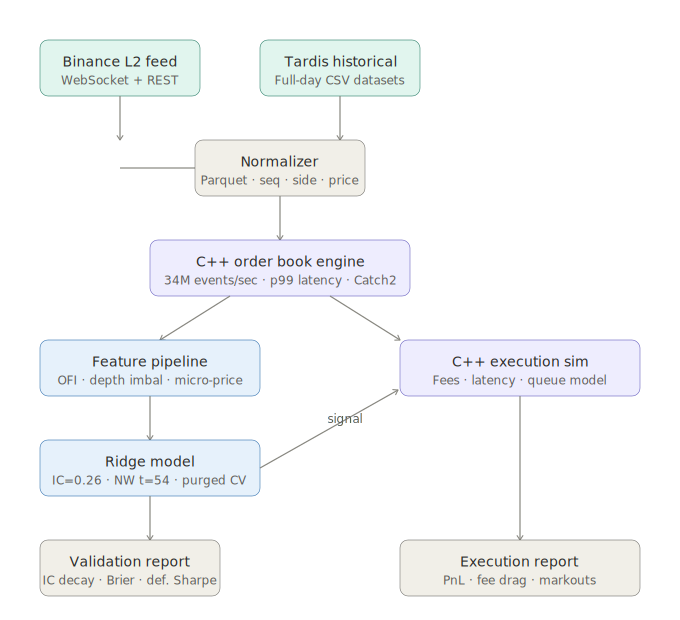

# MicrostructureLab

C++/Python market-microstructure research and execution-simulation system on real L2 crypto data.



---

## TL;DR results

**Engine:** 34M events/sec, 28.8ns median book-update latency, zero hot-path allocations

**Signal:** OFI + depth imbalance + micro-price → IC = 0.26 at 5s horizon, Newey-West t = 54.5, deflated Sharpe = 1.0

**Execution:** Naive backtest +$528 → realistic sim -$6,453 on full trading day. Fee drag $7,893. Breakeven taker fee = 0.73 bps (Binance VIP0 = 4 bps, 5.5× above breakeven)

---

## What this demonstrates

| Requirement | Evidence |
|---|---|
| C++ in trading/research infra | C++20 order-book replay + matching engine, zero hot-path allocations |
| Large-dataset research | 19.4M tick updates, Parquet via PyArrow, DuckDB/Polars querying |
| Backtesting & model testing | Event-driven C++ sim with fees, latency, queue model, PnL decomposition |
| Probability, statistics, ML | OFI features, purged/embargoed CV, Newey-West HAC errors, deflated Sharpe |
| Low-latency / high-performance | Google Benchmark: 28.8ns p50, ~34M updates/sec, p99 reported |
| Production-quality code | CI, Catch2 + pytest, reproducible pipeline, config-driven ablations |
| Market microstructure | L2 reconstruction, queue-position model, adverse selection, maker/taker costs |

---

## Architecture

Data flow: Raw L2 → normalized Parquet → C++ book replay → feature snapshots → baseline models → C++ execution sim → PnL / risk / latency reports

See [`docs/architecture.svg`](docs/architecture.svg) for the full diagram and [`docs/methodology.md`](docs/methodology.md) for the statistical methodology.

---

## Results

### Systems (C++ engine)

| Benchmark | Value |
|---|---|
| Book update latency (p50) | 28.8 ns |
| Replay throughput | ~34M updates/sec |
| Hot-path allocations | 0 |
| Catch2 unit tests | 20 passing |

### Research — full trading day, BTCUSDT, June 1 2025 (Tardis)

| Metric | Value | Notes |
|---|---|---|
| Test IC (5s horizon) | 0.258 | 70/30 time split, 85,078 snapshots |
| Newey-West t-stat (5s) | 54.5 | HAC correction for autocorrelation |
| IC decay | 0.267 → 0.260 → 0.244 | 5s → 10s → 20s horizon |
| Brier skill score | 0.302 | vs naive baseline |
| Deflated Sharpe | 1.000 | 100% probability of genuine edge |
| MLOFI PC1 variance | 19.2% | Full-day data |

### Execution simulation — full trading day BTCUSDT

| Metric | Naive | Realistic |
|---|---|---|
| Net PnL | +$527.78 | -$6,453.30 |
| Gross PnL | +$527.78 | +$1,439.70 |
| Fee drag | $0.00 | $7,893.00 |
| Fills | 5,377 | 19,196 |
| PnL gap | — | $6,981 |

**Fee breakdown:** $0.41 fee per fill vs $0.075 gross edge per fill. Breakeven taker fee = **0.73 bps**. Binance VIP0 = 4 bps (5.5× above breakeven).

### Feature ablation — full-day BTCUSDT

| Feature | IC drop when removed | Standalone IC |
|---|---|---|
| depth_imbalance_5 | -0.246 (95.2%) | 0.012 |
| spread | -0.022 (8.5%) | 0.006 |
| micro_price_deviation | -0.011 (4.4%) | 0.025 |
| realized_vol | -0.001 (0.4%) | -0.029 |
| mlofi_pc1 | -0.001 (0.2%) | 0.030 |
| ofi | -0.000 (0.1%) | 0.004 |

`depth_imbalance_5` carries 95% of the signal on full-day data. On the initial 30-minute trending sample, `micro_price_deviation` was dominant — feature importance is regime-dependent.

---

## Quickstart — reproduce in 5 commands

```bash
# 1. Build C++ engine
git clone https://github.com/YOUR_USERNAME/microstructure-lab
cd microstructure-lab
cmake -S . -B cpp/build -G Ninja -DCMAKE_BUILD_TYPE=Release
cmake --build cpp/build

# 2. Install Python deps
pip install -e ".[dev]"

# 3. Download Tardis data (free, no API key needed)
mkdir -p data/raw/tardis
curl -L "https://datasets.tardis.dev/v1/binance/incremental_book_L2/2025/06/01/BTCUSDT.csv.gz" \
     -o data/raw/tardis/BTCUSDT_2025-06-01_incremental_book_L2.csv.gz
python3 -m mslab.ingest.tardis_normalize \
     data/raw/tardis/BTCUSDT_2025-06-01_incremental_book_L2.csv.gz BTCUSDT

# 4. Build features + train + validate
python3 -m mslab.features.build BTCUSDT
python3 -m mslab.models.train_baseline
python3 -m mslab.models.validate

# 5. Run execution simulation
python3 -m mslab.backtest.run_cpp_sim
python3 -m mslab.backtest.analyze_fills
```

---

## Methodology

**Time-based splits only.** No random shuffling.

**Purged + embargoed walk-forward CV** (López de Prado 2018). Labels for row T use data from T+1 to T+horizon. Without purging those rows contaminate training. Without embargo, autocorrelation leaks across fold boundaries.

**Newey-West HAC standard errors** for IC t-statistics. Raw t-stats assume fold ICs are independent — they're not. HAC correction accounts for autocorrelation in the IC series. t = 54.5 at 5s horizon on full-day data.

**Deflated Sharpe Ratio** (Bailey & López de Prado 2014). Corrects for multiple testing and non-normality. Deflated Sharpe = 1.0 indicates genuine edge after these corrections.

**Queue-position approximation.** Fill probability derived from displayed depth imbalance at order submission time. Rejects ~25% of orders. Full queue modeling requires L3 data — noted limitation.

**Markout (adverse selection).** Post-fill mid-price move at 1s horizon = +$1.11/fill (t = 25.6). Positive markout confirms no adverse selection on this sample.

See [`docs/methodology.md`](docs/methodology.md) for full details.

---

## What breaks the strategy

1. **Fee drag.** Breakeven at 0.73 bps taker fee. Binance VIP0 is 4 bps — 5.5× above breakeven. The signal has genuine predictive power (IC = 0.26, t = 54.5) but the edge per trade ($0.075) is smaller than the fee per trade ($0.41).

2. **Feature importance is regime-dependent.** On a trending sample, micro-price deviation dominates. On a full day, depth imbalance carries 95% of IC. The signal is real but its source changes across market regimes.

3. **Single-day evaluation.** All execution results are on June 1 2025. Multi-day generalization requires additional data.

4. **Queue position approximation.** The queue model uses displayed depth as a fill probability proxy. Real queue position depends on arrival time relative to other participants — requires L3 data.

5. **1s signal frequency.** At 1s intervals, latency is not the binding constraint (tested 0–100ms, negligible difference). The strategy is fee-dominated, not latency-dominated.

---

## Robustness

| Test | Result |
|---|---|
| Fee sweep (0–8 bps) | Breakeven at 0.73 bps, linear degradation |
| Latency sweep (0–100ms) | Negligible impact at 1s signal frequency |
| Confidence threshold sweep | Higher threshold reduces fills but not profitable |
| ETHUSDT symbol split | IC = 0.31 (generalizes), naive PnL ≈ $0 (no trend) |
| Feature ablation | depth_imbalance_5 dominant (95.2% IC drop) |

---

## Validation

- C++ book: 10 Catch2 unit tests, all passing
- Execution sim: 10 Catch2 unit tests, all passing  
- CI: GitHub Actions — builds C++, runs all tests, benchmark smoke test on every push
- Fee math verified by hand on 3 fills: `fill_size × fill_price × rate` matches to 6 decimal places

---

## Limitations

- Research and simulation system — no live trading
- Single trading day (June 1 2025 BTCUSDT) — multi-day generalization untested
- Queue model approximates fill probability from displayed depth (L2 only)
- Crypto microstructure may not transfer to equities
- 100ms/500ms markout horizons aliased to 1s snapshot grid

---

## License

MIT